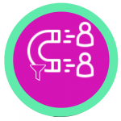

<h5>
    <i aria-hidden="true" class="fas fa-circle primary-color"></i>
    Marketing Digital en tucumán
</h5>

<h1 class="secondary-title">Atraé Clientes. Incrementá tus Ventas.</h1>

    Conseguí mayor impacto y crecimiento mejorando la presencia digital de tu Empresa en redes sociales.

<a class="primary-button" href="https://wa.me/message/EXDH535ELDS6B1" target="_blank" rel="noreferrer nofollow">
    Mejorar mi presencia digital
    <i aria-hidden="true" class="fas fa-angle-right"></i>
</a>

<h1 class="primary-title">¡Redes sociales = + ventas!</h1>

¡Hola! Soy Daniela Narváez. Me especializo en la optimización de redes sociales y estrategias de marketing digital. Ayudo a profesionales; estudios contables, jurídicos y organizaciones sin fines de lucro a mejorar su presencia en las redes sociales de Facebook e Instagram.

¿Sabías que hoy en día <b>el mayor canal de ventas es mediante redes sociales</b>? Estando en plena era digital no es de extrañar, pero además, ¿sabías que <b>la mayoría de los negocios no saben cómo utilizarlas eficientemente</b>?

<h2 class="primary-title text-center">Redes sociales de forma efectiva</h2>

<h3 class="secondary-title">Presencia digital</h3>

Te ayudo a crear tu presencia digital, logrando que tus clientes ideales puedan encontrarte en las redes sociales Facebook e Instagram.

<h3 class="secondary-title">Mayor alcance</h3>

Optimizo tu red social para tener el mayor alcance posible a clientes objetivos.

<h3 class="secondary-title">Planificación</h3>

Planifico la estrategia de publicación semanal y mensual. Asegurando un punto clave en las redes sociales, ¡consistencia!

<h3 class="secondary-title">Estrategia</h3>

Diseño la estrategia acorde a las tendencias del mercado y a los objetivos a corto y largo plazo de tu marca.

<h3 class="secondary-title">Identidad</h3>

Definimos Juntos todos los elementos necesarios crear tu identidad única y alcanzar la distinción con tu competencia.

<h3 class="secondary-title">¡Más Clientes!</h3>

Trabajamos en captación y fidelización de clientes.

<h2 class="primary-title text-center">Paquetes</h2>

<h3 class="secondary-title text-center">Plan Bronce</h3>

Ideal para contadores recién iniciando.

<ul class="secondary-color">
<li>1 red social a elección</li>
<li>Sesión de una hora de Brainstorming para identidad de marca</li>
<li>Creación de cuenta</li>
<li>Facebook: portada, avatar *, 6 plantillas para post</li>
<li>Instagram: avatar *, 3 destacadas, plantilla de feed.</li>
<li>4 sesiones de una hora en asesoramiento y buenas prácticas</li>
</ul>
<h4 class="text-center secondary-title">ARS 4.500</h4>

* (3 revisiones en formato PNG, JPEG, SVG)

<h3 class="secondary-title text-center">Plan Plata</h3>
<h5 class="primary-color text-center">Recomendado</h5>

Ideal para estudios pequeños y/o contadores con trayectoria buscando ampliar su clientela.

<ul class="secondary-color">
<li>Beneficios Plan Bronce</li>
<li>Auditoria de redes sociales</li>
<li>Optimización de perfil</li>
<li>Diseño básico de logo de marca *</li>
<li>Planificación mensual de publicaciones</li>
<li>1 post semanal</li>
<li>8 historias (2 por semana)</li>
<li>Reportes mensual</li>
</ul>
<h4 class="text-center secondary-title">ARS 20.000 / mes</h4>

* (3 revisiones en formato PNG, JPEG, SVG)

<h3 class="secondary-title text-center">Plan Oro</h3>

Si necesitas un plan a tu medida, por favor, contactanos en nuestras redes sociales.

<a href="https://wa.me/message/EXDH535ELDS6B1" target="_blank" rel="noreferrer nofollow">Contactar</a>

<h2 class="primary-title text-center">Preguntas frecuentes</h2>

<h3 class="primary-color">
¿Ofreces descuentos?
</h3>

Actualmente no estoy ofreciendo descuentos aunque estoy trabajando en futuros planes.

<h3 class="primary-color">
¿Cuáles son los medios de pago?
</h3>

Los medios de pago son mediante transferencia bancaria o MercadoPago (tarjetas de débito; transferencia; tarjetas de crédito). El pago se realiza por adelantado.

<h3 class="primary-color">
¿Cuáles son las redes sociales que trabajas?
</h3>

Me enfoco en Facebook e Instagram, ya que, considero son las redes sociales que mejores resultados arrojan.

<h3 class="primary-color">
¿En cuánto tiempo podré ver resultados?
</h3>

Recomiendo a todos mis clientes comenzar con una estrategia mínima de 3 meses. Tené en cuenta que el marketing digital es una actividad que lleva su tiempo y no puede ser acelerada.

<h3 class="primary-color">
¿Puedo llevar las redes sociales por mi cuenta?
</h3>

¡Absolutamente! Aunque recomiendo que mínimamente realices un estudio de mercado; elijas solamente una red social (ya que toman mucha dedicación y tiempo para hacerlo correctamente); y lo más importante, ¡sé consistente! Te recomiendo el Plan Bronce, para que tengas unas bases sólidas y puedas comenzar por tu cuenta.

<h3 class="primary-color">
En lugar de manejar redes sociales, ¿no podría simplemente pagar publicidad?
</h3>

Desde mi perspectiva, es un gasto no medido. No obtendrás los resultados que estás buscando y solo será un gasto de dinero. Te recomiendo el Plan Bronce para que puedas aprender al respecto.

<h2 class="primary-title text-center">Mirá lo que dicen mis clientes</h2>

<h5>Ayi Zurita</h5>
<a class="primary-color" href="https://www.instagram.com/movimientofucsia_tucuman/" target="_blank" rel="noreferrer nofollow">@Movimiento Fucsia</a>

"Las palabras que definen a Daniela son innovación, organización y estrategia, ya que desde que cuento con su trabajo mis redes sociales han incrementado notablemente visibilidad y se han puesto a la altura de las mejores."

<h5>Raúl Arévalo</h5>
<a class="primary-color" href="https://www.instagram.com/cubodelaverdadtucuman/" target="_blank" rel="noreferrer nofollow">@El Cubo de la Verdad</a>

"Daniela es una persona con un excelente ojo crítico, es analista y detallista, supo captar nuestros valores y volcarlos en la comunicación gráfica de varias campañas de nuestra agrupación."

<h5>C&F</h5>
<a class="primary-color" href="https://www.instagram.com/cyf.asesoramiento.contable/" target="_blank" rel="noreferrer nofollow">@C&F</a>

"Muy conformes con el asesoramiento de Daniela. Excelente relación interpersonal, muy comunicativa, ordenada y comprometida con el trabajo, recomendadisimo para los emprendimientos que recién comienzan y buscan llegar a potenciales clientes!"

<h2 class="primary-title">¿Listo para mejorar tu negocio?</h2>
<a class="primary-button" href="https://wa.me/message/EXDH535ELDS6B1" target="_blank" rel="noreferrer nofollow">
    <i aria-hidden="true" class="fab fa-whatsapp"></i>
    Si, quiero mejorar mi negocio
</a>

